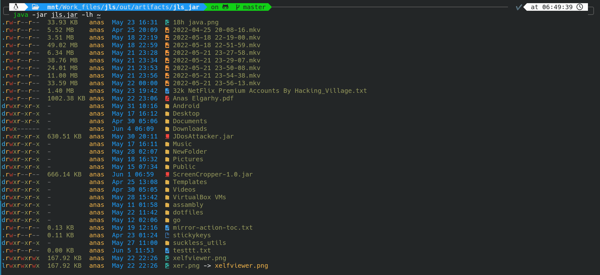

# jls: modern ls using java ☕

## Features
- Support text color.
- Support icons for file type (require nerd-font).

## Options table
| Option                     | Value                                                                 | Description                                                     |
|----------------------------|-----------------------------------------------------------------------|-----------------------------------------------------------------|
| `--help`                   | n/a                                                                   | Show help message                                               |
| `-v` or `--version`        | n/a                                                                   | Show version                                                    |
| `-a` or `--all`            | n/a                                                                   | Show all files including hidden files                           |
| `-l` or `--long`           | n/a                                                                   | Show long format                                                |
| `-G` or `--group`          | n/a                                                                   | Show group name in long format                                  |
| `-h` or `--human-readable` | n/a                                                                   | Show human readable size                                        |
| `-s` or `--size`           | n/a                                                                   | Show file size in normal format                                 |
| `-S`                       | n/a                                                                   | Sort by size (largest first)                                    |
| `-R` or `--revcursive`     | n/a                                                                   | Show files in sub-directories recursively (not implemented yet) |
 | `-nc` or `--no-icons`      | n/a                                                                   | Don't show icons                                                |
| `-ic` or `--icons-color`   | Icon color in hex format or Auto for auto color (not implemented yet) | Use custom icons color                                          |
 | `-tc` or `--text-color`    | Text color in hex format or Auto for auto color (not implemented yet) | Use custom text color                                           |
| `--no-owner`               | n/a                                                                   | Don't show owner name in long format                            |
| --no-colors                | n/a                                                                   | Don't use colors                                                |
| `-nd` or `--no-date`       | n/a                                                                   | Don't show last modified date                                   |
| `-nn` or `--no-name`       | n/a                                                                   | Don't show file name                                            |
| `-L`                       | n/a                                                                   | Sort by last modified date (latest first)                       |

## Requirements for development:
- nerd-font
- Gradle 7.4
- jdk 17
- IntelliJ IDEA (not required but recommended)